# Черновик · System architecture PQQM

```mermaid
flowchart LR
    A["Айгуль / закупщик\nсписок моделей и ссылок"] --> B
    S["Карточки поставщиков\nцена · наличие · статус"] --> C

    subgraph D["departments/oborudovanie/ · зона отдела"]
      B["Каталог оборудования\nID · категория · URL"]
      C["Сборщик PQQM\nнормализация карточек"]
      B --> C
      C --> V["Проверка достоверности\nlisted / on_request\nв наличии / нет"]
      V --> J["data/snapshot-*.json\nконтракт v2"]
    end

    S -. "403 · капча · ошибка" .-> U["source_status: unreachable\nне считать товары пропавшими"]
    U --> J

    subgraph K["Общая платформа комнаты"]
      J --> CORE["core\nсравнение двух снимков\nпороги +5% / +10%"]
      CORE --> DASH["Дашборд кухни\nHTML + Markdown-дайджест"]
    end

    DASH --> R["Закупщик\nвидит изменения и полноту данных"]
    R --> H{{"Ручное решение\nальтернатива / стоп-лист / заказ"}}

    classDef person fill:#FFDF91,stroke:#8A5A00,color:#302000;
    classDef module fill:#D7EDFF,stroke:#166B9D,color:#092A3A;
    classDef data fill:#DFF5DF,stroke:#2E7D32,color:#173A1A;
    classDef alert fill:#FFE0E0,stroke:#B3261E,color:#4A0804;
    class A,R,H person;
    class B,C,V,CORE,DASH module;
    class J data;
    class S,U alert;
```

## Как читать

1. Айгуль передаёт не код, а конфигурацию: список моделей и ссылок.
2. В зоне отдела данные карточек превращаются в нормализованные снимки v2.
3. Даже при недоступности сайта снимок остаётся честным: это недоступный
   источник, а не исчезнувшая позиция.
4. `core` не знает доменную логику отдела: он только сопоставляет снимки и
   выводит изменения.
5. Последнее действие всегда остаётся у закупщика.
